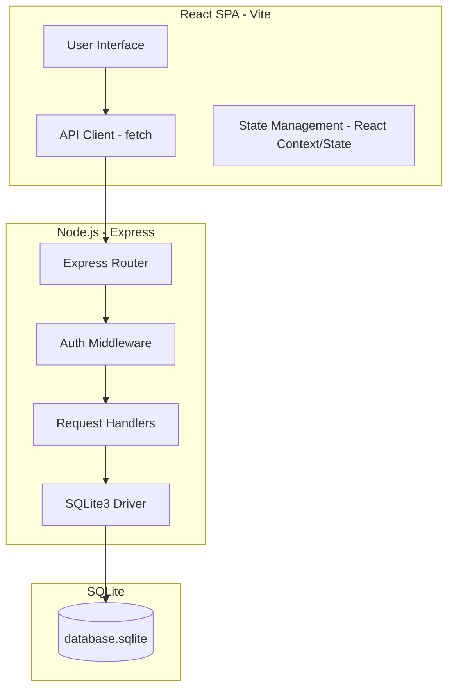

# Architecture - Asset Inspection Platform

This document describes the high-level architecture of the Asset Inspection Platform, an industrial inspection system designed to manage assets, schedule and record inspections, capture attachments, and generate operational metrics.

## Tech Stack Overview

### Frontend
- **Framework:** React 18+ (bundled via Vite)
- **Styling:** Vanilla CSS (custom layout system, dark mode theme)
- **Routing:** Component-based state-driven routing for simplicity and fast loading.
- **HTTP Client:** Native browser `fetch` API.

### Backend
- **Platform:** Node.js
- **Framework:** Express
- **Database Driver:** `sqlite3`
- **Authentication:** JSON Web Tokens (JWT) & bcrypt for password hashing.
- **Testing Framework:** Jest & Supertest.

### Database Schema
The database uses a single local database file (`database.sqlite`) with the following relational schema:
- **`users`**: Stores login credentials, names, and roles (`admin`, `inspector`).
- **`assets`**: Represents industrial equipment (e.g., pipelines, wind turbines, drones) with names, codes, types, and statuses (`active`, `maintenance`, `inactive`).
- **`inspections`**: Contains inspection reports, status (`draft`, `pending`, `approved`), findings, recommendations, and foreign keys linking to the asset and inspector.
- **`attachments`**: Contains logs of files uploaded (stored locally in `/uploads` on the backend) linked to specific inspections.

---

## Deployment & Containerization

The platform is designed to be easily spun up in any environment using Docker.
- A **`docker-compose.yml`** orchestrates two containers:
  1. `frontend`: Node Alpine base, runs the Vite dev server or hosts static build assets.
  2. `backend`: Node Alpine base, mounts a volume for persisting `database.sqlite` and uploaded attachments, exposes port `5000`.
