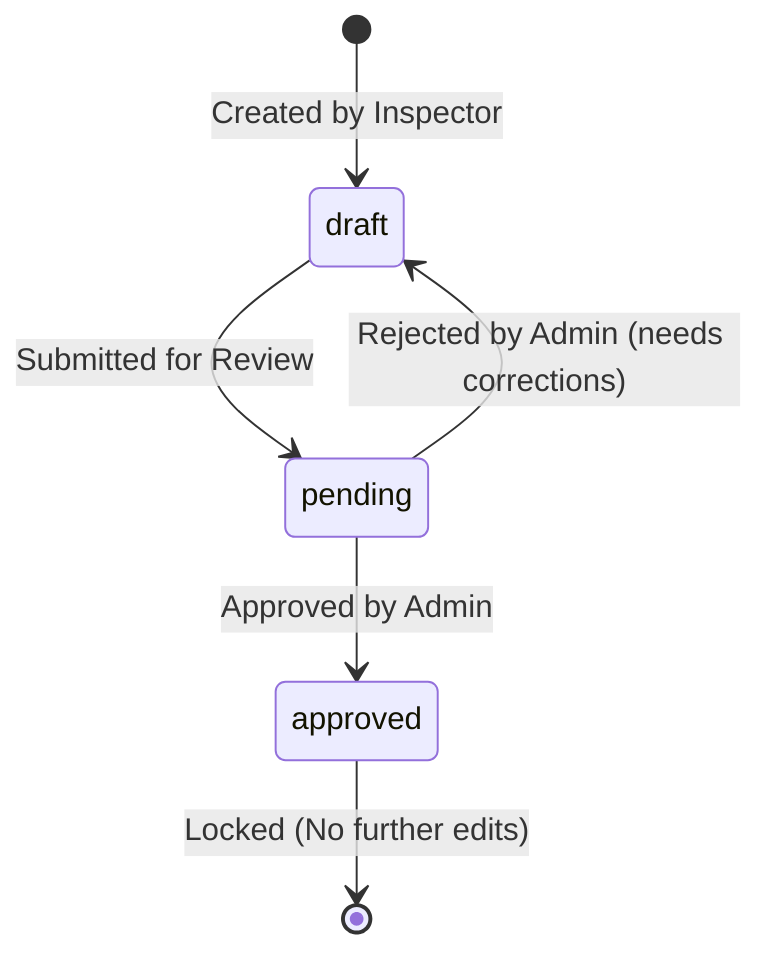

# Business Rules - Asset Inspection Platform

This document outlines the core business logic, permissions, workflows, and state transitions enforced (or expected to be enforced) by the platform.

## 1. User Roles and Permissions

The system supports two user roles:
- **`admin`**: Has full administrative permissions. Can perform CRUD operations on assets, manage users, create and review inspections, and view all system reports.
- **`inspector`**: Has field access. Can view assets, create inspections, edit their own draft or pending inspections, and upload attachments. Cannot delete assets or inspections, and cannot approve inspections.

| Action | Admin | Inspector | Guest |
| :--- | :---: | :---: | :---: |
| Authenticate / View Profile | Yes | Yes | No |
| View Assets | Yes | Yes | No |
| Create / Edit / Delete Assets | Yes | No | No |
| View Inspections | Yes | Yes | No |
| Create Inspections | Yes | Yes | No |
| Edit Inspections (Draft / Pending) | Yes | Yes | No |
| Approve Inspections | Yes | No | No |
| Edit Approved Inspections | **No** | **No** | No |
| Delete Inspections | Yes | No | No |
| Upload Attachments | Yes | Yes | No |
| View Reports / Metrics | Yes | Yes | No |

---

## 2. Asset States

Assets represent the physical machinery or components under inspection. An asset has one of the following statuses:
- **`active`**: Currently operating. Eligible for inspections.
- **`maintenance`**: Under repair. Inspection is recommended to certify return to service.
- **`inactive`**: Decommissioned or out of service. Should not be inspected.

---

## 3. Inspection Workflow

Inspections follow a linear lifecycle:

### State Transitions
1. **`draft`**: The inspection is being compiled. The inspector can save changes, upload photos, and edit findings.
2. **`pending`**: The inspector has submitted the inspection for review. It is now visible to Admins for approval. Editors can still modify it if details change before approval.
3. **`approved`**: An Admin reviews the inspection and marks it as approved.
   - **LOCK RULE:** Once an inspection is in the `approved` state, it is locked. Under no circumstances should any user (including Admins) be able to edit the findings, recommendation, asset details, or upload new attachments. The inspection is now a permanent audit record.

---

## 4. Attachments

- Inspectors and Admins can upload photos, drone footage screenshots, or sensor logs (JPG, PNG, PDF) to support their findings.
- Multiple attachments can be uploaded per inspection.
- Attachments are stored securely and must be linked to a valid inspection ID.
- Upward sync must prevent data corruption if multiple attachments are uploaded concurrently.
